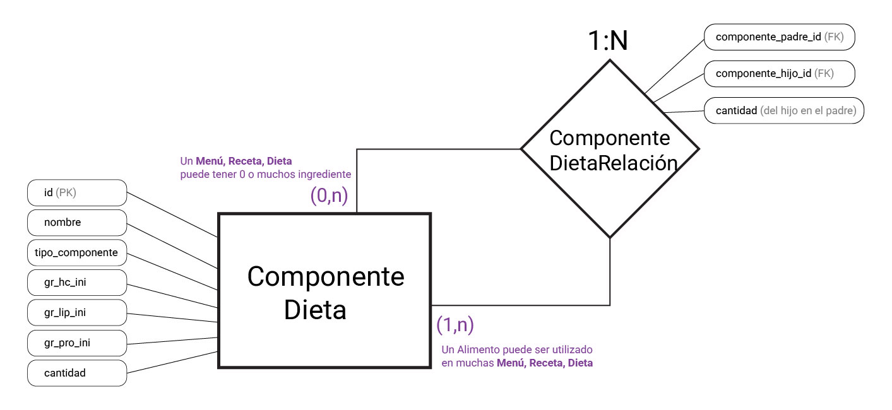
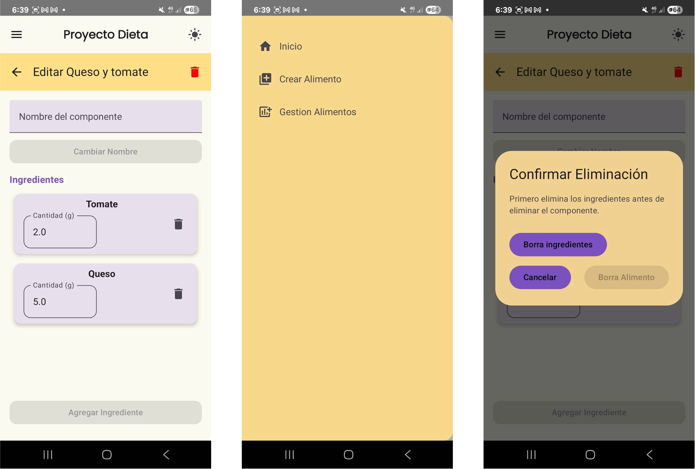
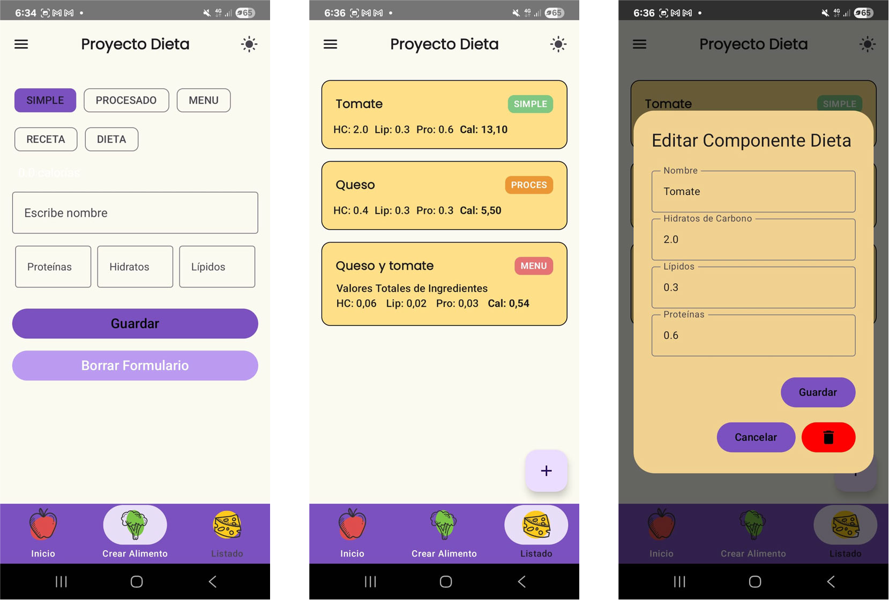
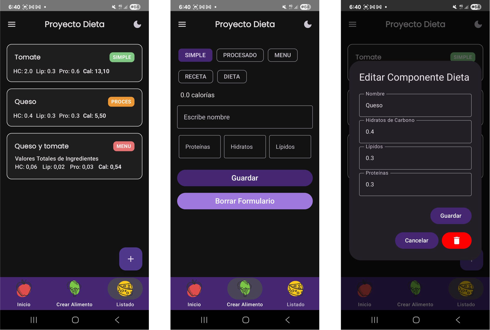

🍲 App de Recetas – Cocina Fácil

"Cocina Fácil" es una aplicación móvil desarrollada con Jetpack Compose para la interfaz de usuario y Room como solución de persistencia local. La app está diseñada para facilitar la organización, consulta y gestión de recetas desde tu dispositivo Android, con una interfaz moderna, fluida y centrada en la experiencia del usuario.

Gracias a Jetpack Compose, la app logra una arquitectura limpia, modular y totalmente declarativa, permitiendo vistas altamente personalizables y dinámicas sin necesidad de XML. Por otro lado, Room proporciona una capa de abstracción robusta sobre SQLite, facilitando el acceso eficiente y seguro a la base de datos local.

## El flujo principal permite al usuario:

- Ver una lista de recetas almacenadas.
- Consultar el detalle de cada receta.
- Añadir o eliminar recetas de manera intuitiva.

## Diagrama Relacional

## Capturas de pantalla de la aplicación

## Se han trabajdo los colores en modalidad Pantalla Oscura y Luminosa

